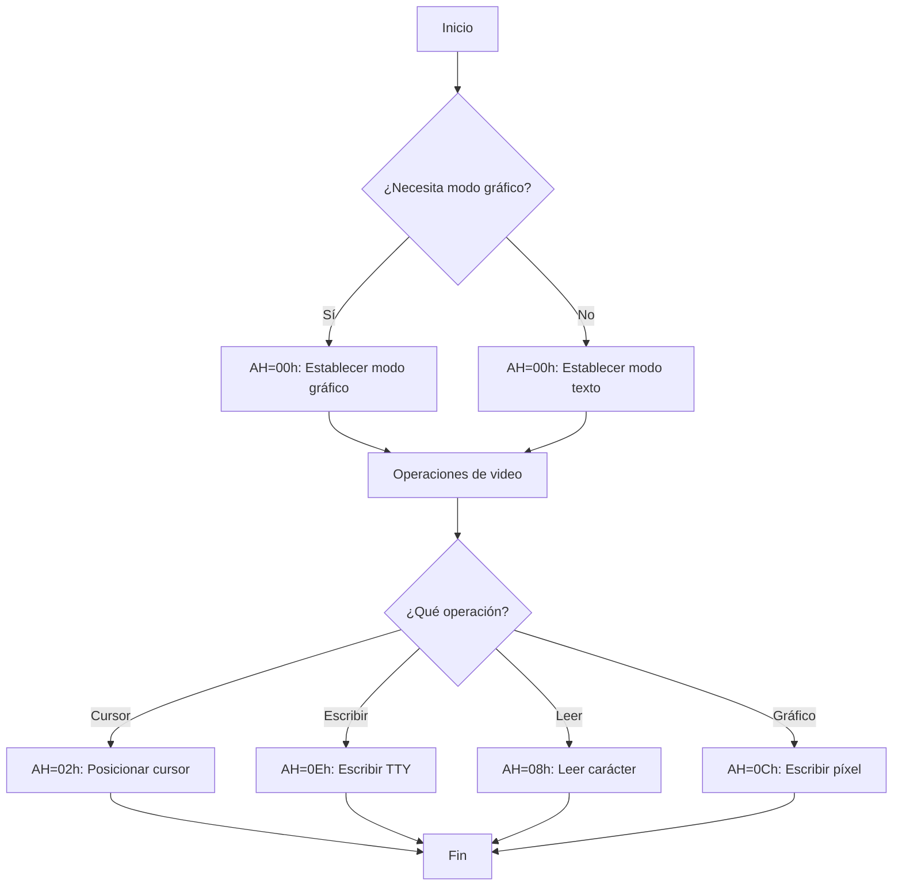

# Interrupción 10h - Servicios de Video BIOS (8086)

## Descripción General

La interrupción **10h** es la interrupción del BIOS (Basic Input/Output System) que proporciona servicios de video. Permite controlar la pantalla, el cursor, los modos de video y otras funciones gráficas del sistema.

## Registro de Función (AH)

El registro **AH** especifica la función a ejecutar. A continuación se detallan todas las funciones disponibles:

---

## Funciones Principales

### AH = 00h - Establecer Modo de Video

**Descripción:** Configura el modo de video del sistema.

| Registro | Valor | Descripción |
|----------|-------|-------------|
| AH | 00h | Función |
| AL | Modo | Modo de video a establecer |

**Modos de Video Comunes:**
| Modo | Tipo | Resolución | Colores |
|------|------|------------|---------|
| 00h | Texto | 40x25 | Blanco/Negro |
| 01h | Texto | 40x25 | 16 colores |
| 02h | Texto | 80x25 | Blanco/Negro |
| 03h | Texto | 80x25 | 16 colores |
| 04h | Gráfico | 320x200 | 4 colores |
| 05h | Gráfico | 320x200 | 4 colores |
| 06h | Gráfico | 640x200 | 2 colores |
| 07h | Texto | 80x25 | Monocromo |
| 0Dh | Gráfico | 320x200 | 16 colores |
| 0Eh | Gráfico | 640x200 | 16 colores |
| 0Fh | Gráfico | 640x350 | Monocromo |
| 10h | Gráfico | 640x350 | 16 colores |
| 11h | Gráfico | 640x480 | 2 colores |
| 12h | Gráfico | 640x480 | 16 colores |
| 13h | Gráfico | 320x200 | 256 colores |

**Ejemplo:**
```assembly
MOV AH, 00h    ; Función establecer modo
MOV AL, 03h    ; Modo texto 80x25, 16 colores
INT 10h        ; Llamar a la interrupción
```

---

### AH = 01h - Establecer Forma del Cursor

**Descripción:** Define la forma y tamaño del cursor de texto.

| Registro | Valor | Descripción |
|----------|-------|-------------|
| AH | 01h | Función |
| CH | Línea inicio | Línea de inicio del cursor (0-7) |
| CL | Línea fin | Línea de fin del cursor (0-7) |

**Valores Especiales:**
- CH = 20h: Cursor invisible
- CH = 00h, CL = 07h: Cursor completo (bloque)
- CH = 06h, CL = 07h: Cursor subrayado (por defecto)

**Ejemplo:**
```assembly
MOV AH, 01h    ; Función establecer forma del cursor
MOV CH, 00h    ; Línea de inicio
MOV CL, 07h    ; Línea de fin (cursor bloque completo)
INT 10h        ; Llamar a la interrupción
```

---

### AH = 02h - Establecer Posición del Cursor

**Descripción:** Posiciona el cursor en una ubicación específica de la pantalla.

| Registro | Valor | Descripción |
|----------|-------|-------------|
| AH | 02h | Función |
| BH | Página | Página de video (generalmente 0) |
| DH | Fila | Fila (0-24 en modo 25 filas) |
| DL | Columna | Columna (0-79 en modo 80 columnas) |

**Ejemplo:**
```assembly
MOV AH, 02h    ; Función establecer posición
MOV BH, 00h    ; Página 0
MOV DH, 12     ; Fila 12 (centro vertical)
MOV DL, 40     ; Columna 40 (centro horizontal)
INT 10h        ; Llamar a la interrupción
```

---

### AH = 03h - Leer Posición y Forma del Cursor

**Descripción:** Obtiene la posición actual del cursor y su forma.

| Registro | Valor | Descripción |
|----------|-------|-------------|
| AH | 03h | Función |
| BH | Página | Página de video a consultar |

**Salida:**
| Registro | Descripción |
|----------|-------------|
| DH | Fila actual del cursor |
| DL | Columna actual del cursor |
| CH | Línea de inicio del cursor |
| CL | Línea de fin del cursor |

**Ejemplo:**
```assembly
MOV AH, 03h    ; Función leer posición
MOV BH, 00h    ; Página 0
INT 10h        ; Llamar a la interrupción
; DH = fila, DL = columna, CH/CL = forma del cursor
```

---

### AH = 05h - Seleccionar Página de Video Activa

**Descripción:** Selecciona cuál página de video mostrar.

| Registro | Valor | Descripción |
|----------|-------|-------------|
| AH | 05h | Función |
| AL | Página | Número de página (0-7) |

**Ejemplo:**
```assembly
MOV AH, 05h    ; Función seleccionar página
MOV AL, 01h    ; Seleccionar página 1
INT 10h        ; Llamar a la interrupción
```

---

### AH = 06h - Desplazar Ventana hacia Arriba

**Descripción:** Desplaza una región de la pantalla hacia arriba.

| Registro | Valor | Descripción |
|----------|-------|-------------|
| AH | 06h | Función |
| AL | Líneas | Número de líneas a desplazar (0 = limpiar) |
| BH | Atributo | Atributo de color para líneas vacías |
| CH | Fila inicio | Fila superior de la ventana |
| CL | Columna inicio | Columna izquierda de la ventana |
| DH | Fila fin | Fila inferior de la ventana |
| DL | Columna fin | Columna derecha de la ventana |

**Atributos de Color (BH):**
| Bits | Descripción |
|------|-------------|
| 7 | Parpadeo |
| 6-4 | Fondo (R, G, B) |
| 3-0 | Primer plano (I, R, G, B) |

**Ejemplo:**
```assembly
MOV AH, 06h    ; Función desplazar arriba
MOV AL, 01h    ; Desplazar 1 línea
MOV BH, 07h    ; Atributo: blanco sobre negro
MOV CH, 0      ; Fila inicio
MOV CL, 0      ; Columna inicio
MOV DH, 24     ; Fila fin
MOV DL, 79     ; Columna fin
INT 10h        ; Llamar a la interrupción
```

---

### AH = 07h - Desplazar Ventana hacia Abajo

**Descripción:** Desplaza una región de la pantalla hacia abajo.

| Registro | Valor | Descripción |
|----------|-------|-------------|
| AH | 07h | Función |
| AL | Líneas | Número de líneas a desplazar (0 = limpiar) |
| BH | Atributo | Atributo de color para líneas vacías |
| CH | Fila inicio | Fila superior de la ventana |
| CL | Columna inicio | Columna izquierda de la ventana |
| DH | Fila fin | Fila inferior de la ventana |
| DL | Columna fin | Columna derecha de la ventana |

**Ejemplo:**
```assembly
MOV AH, 07h    ; Función desplazar abajo
MOV AL, 01h    ; Desplazar 1 línea
MOV BH, 1Fh    ; Atributo: amarillo sobre azul
MOV CH, 0      ; Fila inicio
MOV CL, 0      ; Columna inicio
MOV DH, 24     ; Fila fin
MOV DL, 79     ; Columna fin
INT 10h        ; Llamar a la interrupción
```

---

### AH = 08h - Leer Atributo/Carácter en Posición del Cursor

**Descripción:** Lee el carácter y su atributo en la posición actual del cursor.

| Registro | Valor | Descripción |
|----------|-------|-------------|
| AH | 08h | Función |
| BH | Página | Página de video |

**Salida:**
| Registro | Descripción |
|----------|-------------|
| AL | Carácter ASCII |
| AH | Atributo de color |

**Ejemplo:**
```assembly
MOV AH, 08h    ; Función leer carácter/atributo
MOV BH, 00h    ; Página 0
INT 10h        ; Llamar a la interrupción
; AL = carácter, AH = atributo
```

---

### AH = 09h - Escribir Carácter y Atributo en Posición del Cursor

**Descripción:** Escribe un carácter con un atributo específico en la posición del cursor.

| Registro | Valor | Descripción |
|----------|-------|-------------|
| AH | 09h | Función |
| AL | Carácter | Código ASCII del carácter |
| BH | Página | Página de video |
| BL | Atributo | Atributo de color |
| CX | Contador | Número de veces a escribir |

**Ejemplo:**
```assembly
MOV AH, 09h    ; Función escribir carácter
MOV AL, 'A'    ; Carácter 'A'
MOV BH, 00h    ; Página 0
MOV BL, 0Fh    ; Atributo: blanco brillante
MOV CX, 1      ; Escribir 1 vez
INT 10h        ; Llamar a la interrupción
```

---

### AH = 0Ah - Escribir Carácter en Posición del Cursor

**Descripción:** Escribe un carácter en la posición del cursor sin cambiar el atributo.

| Registro | Valor | Descripción |
|----------|-------|-------------|
| AH | 0Ah | Función |
| AL | Carácter | Código ASCII del carácter |
| BH | Página | Página de video |
| BL | Color | Color (solo en modo gráfico) |
| CX | Contador | Número de veces a escribir |

**Ejemplo:**
```assembly
MOV AH, 0Ah    ; Función escribir carácter
MOV AL, 'B'    ; Carácter 'B'
MOV BH, 00h    ; Página 0
MOV CX, 1      ; Escribir 1 vez
INT 10h        ; Llamar a la interrupción
```

---

### AH = 0Bh - Establecer Paleta de Colores

**Descripción:** Configura la paleta de colores en modos gráficos.

| Registro | Valor | Descripción |
|----------|-------|-------------|
| AH | 0Bh | Función |
| BH | Modo | 0 = paleta, 1 = borde |
| BL | Color | Color o número de paleta |

**Ejemplo:**
```assembly
MOV AH, 0Bh    ; Función establecer paleta
MOV BH, 00h    ; Modo paleta
MOV BL, 01h    ; Paleta 1
INT 10h        ; Llamar a la interrupción
```

---

### AH = 0Ch - Escribir Punto (Píxel)

**Descripción:** Dibuja un punto (píxel) en la pantalla en modo gráfico.

| Registro | Valor | Descripción |
|----------|-------|-------------|
| AH | 0Ch | Función |
| AL | Color | Color del píxel |
| BH | Página | Página de video |
| CX | Columna | Coordenada X (columna) |
| DX | Fila | Coordenada Y (fila) |

**Ejemplo:**
```assembly
MOV AH, 0Ch    ; Función escribir punto
MOV AL, 0Fh    ; Color blanco
MOV BH, 00h    ; Página 0
MOV CX, 100    ; Columna 100
MOV DX, 50     ; Fila 50
INT 10h        ; Llamar a la interrupción
```

---

### AH = 0Dh - Leer Punto (Píxel)

**Descripción:** Lee el color de un punto (píxel) en la pantalla en modo gráfico.

| Registro | Valor | Descripción |
|----------|-------|-------------|
| AH | 0Dh | Función |
| BH | Página | Página de video |
| CX | Columna | Coordenada X (columna) |
| DX | Fila | Coordenada Y (fila) |

**Salida:**
| Registro | Descripción |
|----------|-------------|
| AL | Color del píxel |

**Ejemplo:**
```assembly
MOV AH, 0Dh    ; Función leer punto
MOV BH, 00h    ; Página 0
MOV CX, 100    ; Columna 100
MOV DX, 50     ; Fila 50
INT 10h        ; Llamar a la interrupción
; AL = color del píxel
```

---

### AH = 0Eh - Escribir TTY (Teleprinter)

**Descripción:** Escribe un carácter en modo teletipo, avanzando automáticamente el cursor.

| Registro | Valor | Descripción |
|----------|-------|-------------|
| AH | 0Eh | Función |
| AL | Carácter | Código ASCII del carácter |
| BH | Página | Página de video |
| BL | Color | Color (solo en modo gráfico) |

**Caracteres Especiales:**
- 07h: Beep (alarma)
- 08h: Retroceso (backspace)
- 0Dh: Retorno de carro
- 0Ah: Salto de línea

**Ejemplo:**
```assembly
MOV AH, 0Eh    ; Función TTY
MOV AL, 'H'    ; Carácter 'H'
MOV BH, 00h    ; Página 0
INT 10h        ; Llamar a la interrupción
```

---

### AH = 0Fh - Leer Modo de Video Actual

**Descripción:** Obtiene el modo de video actual, número de columnas y página activa.

| Registro | Valor | Descripción |
|----------|-------|-------------|
| AH | 0Fh | Función |

**Salida:**
| Registro | Descripción |
|----------|-------------|
| AL | Modo de video actual |
| AH | Número de columnas |
| BH | Página activa |

**Ejemplo:**
```assembly
MOV AH, 0Fh    ; Función leer modo
INT 10h        ; Llamar a la interrupción
; AL = modo, AH = columnas, BH = página
```

---

## Tabla de Atributos de Color (Modo Texto)

### Byte de Atributo (8 bits)

```
Bit:  7  6  5  4  3  2  1  0
      │  └──┬──┘  │  └──┬──┘
      │     │     │     │
      │     │     │     └── Color primer plano (R, G, B, I)
      │     │     └──────── Intensidad primer plano
      │     └────────────── Color fondo (R, G, B)
      └──────────────────── Parpadeo
```

### Colores Primer Plano (bits 0-3)
| Valor | Color |
|-------|-------|
| 0 | Negro |
| 1 | Azul |
| 2 | Verde |
| 3 | Cian |
| 4 | Rojo |
| 5 | Magenta |
| 6 | Marrón |
| 7 | Blanco |
| 8 | Gris |
| 9 | Azul brillante |
| A | Verde brillante |
| B | Cian brillante |
| C | Rojo brillante |
| D | Magenta brillante |
| E | Amarillo |
| F | Blanco brillante |

### Ejemplos de Atributos
| Atributo | Descripción |
|----------|-------------|
| 07h | Blanco sobre negro (estándar) |
| 0Fh | Blanco brillante sobre negro |
| 1Fh | Blanco brillante sobre azul |
| 2Fh | Blanco brillante sobre verde |
| 4Fh | Blanco brillante sobre rojo |
| 70h | Negro sobre blanco (invertido) |
| 87h | Blanco sobre negro con parpadeo |

---

## Ejemplos Completos

### Ejemplo 1: Limpiar Pantalla
```assembly
MOV AH, 06h    ; Función desplazar arriba
MOV AL, 00h    ; Limpiar toda la ventana
MOV BH, 07h    ; Atributo: blanco sobre negro
MOV CH, 0      ; Fila inicio
MOV CL, 0      ; Columna inicio
MOV DH, 24     ; Fila fin
MOV DL, 79     ; Columna fin
INT 10h        ; Llamar a la interrupción
```

### Ejemplo 2: Escribir Mensaje en Centro de Pantalla
```assembly
; Posicionar cursor en centro
MOV AH, 02h
MOV BH, 00h
MOV DH, 12     ; Fila 12
MOV DL, 35     ; Columna 35
INT 10h

; Escribir carácter
MOV AH, 0Eh
MOV AL, 'H'
INT 10h
MOV AL, 'O'
INT 10h
MOV AL, 'L'
INT 10h
MOV AL, 'A'
INT 10h
```

### Ejemplo 3: Dibujar Punto en Gráfico
```assembly
; Establecer modo gráfico
MOV AH, 00h
MOV AL, 13h    ; Modo 320x200, 256 colores
INT 10h

; Dibujar punto
MOV AH, 0Ch
MOV AL, 0Fh    ; Color blanco
MOV CX, 160    ; Centro X
MOV DX, 100    ; Centro Y
INT 10h
```

### Ejemplo 4: Cursor Invisible
```assembly
MOV AH, 01h
MOV CH, 20h    ; Bit 5 establecido = cursor invisible
MOV CL, 00h
INT 10h
```

### Ejemplo 5: Leer y Restaurar Posición del Cursor
```assembly
; Guardar posición
MOV AH, 03h
MOV BH, 00h
INT 10h
PUSH DX        ; Guardar fila/columna

; ... hacer otras operaciones ...

; Restaurar posición
POP DX
MOV AH, 02h
MOV BH, 00h
INT 10h
```

---

## Notas Importantes

1. **Página de Video:** En modo texto, generalmente se usa la página 0 (BH = 00h).

2. **Modo de Video:** Siempre establezca el modo de video antes de usar otras funciones.

3. **Cursor:** El cursor se mueve automáticamente con funciones como 0Eh (TTY).

4. **Atributos:** En modo texto, cada carácter tiene un byte de atributo que define su color.

5. **Coordenadas:** Las coordenadas son basadas en 0 (0,0 es la esquina superior izquierda).

6. **Páginas de Video:** El sistema puede tener múltiples páginas de video (0-7) que permiten cambiar entre pantallas.

---

## Referencia Rápida

| AH | Función | Descripción |
|----|---------|-------------|
| 00h | Set Video Mode | Establecer modo de video |
| 01h | Set Cursor Type | Establecer forma del cursor |
| 02h | Set Cursor Position | Establecer posición del cursor |
| 03h | Get Cursor Position | Leer posición del cursor |
| 05h | Select Active Page | Seleccionar página activa |
| 06h | Scroll Up | Desplazar ventana arriba |
| 07h | Scroll Down | Desplazar ventana abajo |
| 08h | Read Char/Attr | Leer carácter y atributo |
| 09h | Write Char/Attr | Escribir carácter y atributo |
| 0Ah | Write Character | Escribir carácter |
| 0Bh | Set Color Palette | Establecer paleta de colores |
| 0Ch | Write Pixel | Escribir punto (píxel) |
| 0Dh | Read Pixel | Leer punto (píxel) |
| 0Eh | Write TTY | Escribir en modo teletipo |
| 0Fh | Get Video Mode | Leer modo de video actual |

---

## Diagrama de Flujo de Uso



---

**Documentación completa de la interrupción 10h del BIOS para procesador 8086**
